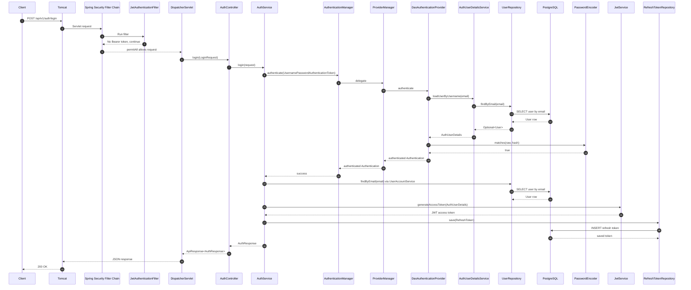
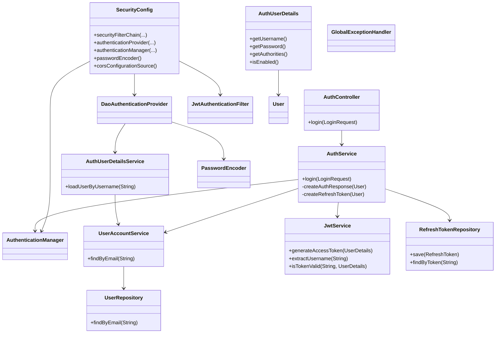
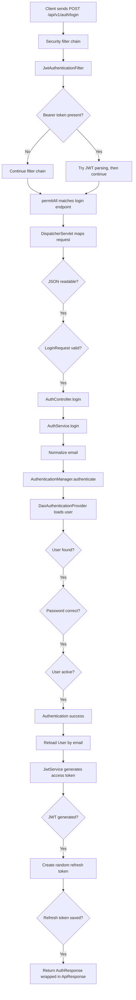
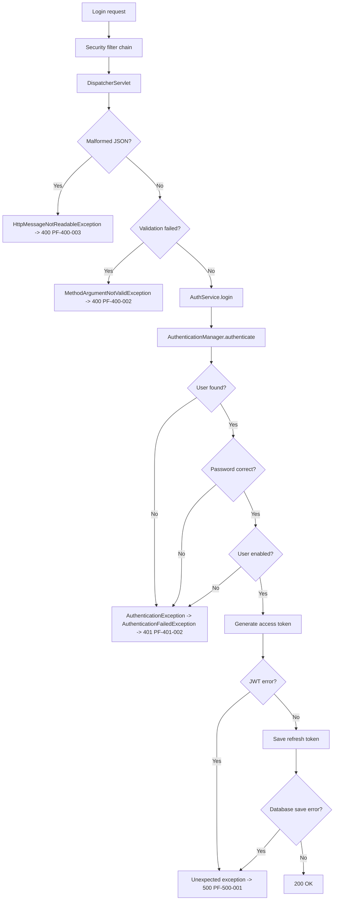

# PayFlow Login Journey Deep Dive

This note explains the current PayFlow login flow for:

```http
POST /api/v1/auth/login
```

It is based on the current project code. When a behavior is provided by Spring, Spring MVC, Spring Security, Jackson, Hibernate, or Flyway, it is marked as framework behavior. When PayFlow code performs the behavior, it is marked as PayFlow behavior.

No real passwords, tokens, JWT secrets, or user data are shown here.

---

## Classes Inspected

| Area | Source |
| ---- | ------ |
| Application startup | `src/main/java/com/monika/payflow/PayflowApplication.java` |
| Security configuration | `src/main/java/com/monika/payflow/common/config/SecurityConfig.java` |
| Login controller | `src/main/java/com/monika/payflow/auth/controller/AuthController.java` |
| Login service | `src/main/java/com/monika/payflow/auth/service/AuthService.java` |
| Login DTO | `src/main/java/com/monika/payflow/auth/dto/LoginRequest.java` |
| Login response DTO | `src/main/java/com/monika/payflow/auth/dto/AuthResponse.java` |
| UserDetailsService | `src/main/java/com/monika/payflow/auth/security/AuthUserDetailsService.java` |
| UserDetails implementation | `src/main/java/com/monika/payflow/auth/security/AuthUserDetails.java` |
| JWT service | `src/main/java/com/monika/payflow/auth/security/JwtService.java` |
| JWT filter | `src/main/java/com/monika/payflow/auth/security/JwtAuthenticationFilter.java` |
| Auth entry point | `src/main/java/com/monika/payflow/auth/security/JwtAuthenticationEntryPoint.java` |
| JWT properties | `src/main/java/com/monika/payflow/auth/security/JwtProperties.java` |
| User service | `src/main/java/com/monika/payflow/user/service/UserAccountService.java` |
| User repository | `src/main/java/com/monika/payflow/user/repository/UserRepository.java` |
| User entity | `src/main/java/com/monika/payflow/user/entity/User.java` |
| User role/status | `src/main/java/com/monika/payflow/user/entity/UserRole.java`, `src/main/java/com/monika/payflow/user/entity/UserStatus.java` |
| Refresh token entity | `src/main/java/com/monika/payflow/auth/entity/RefreshToken.java` |
| Refresh token repository | `src/main/java/com/monika/payflow/auth/repository/RefreshTokenRepository.java` |
| API wrapper | `src/main/java/com/monika/payflow/common/api/ApiResponse.java` |
| Error handling | `src/main/java/com/monika/payflow/common/exception/GlobalExceptionHandler.java` |
| Error codes | `src/main/java/com/monika/payflow/common/error/ErrorCode.java` |
| Config values | `src/main/resources/application.yaml` |
| Database schema | `src/main/resources/db/migration/V2__create_users_table.sql`, `V3__create_refresh_tokens_table.sql` |
| Tests | `src/test/java/com/monika/payflow/auth/service/AuthServiceTest.java`, `src/test/java/com/monika/payflow/auth/security/JwtServiceTest.java` |

---

## Big Picture

The login endpoint does not itself compare passwords. PayFlow asks Spring Security to authenticate the email and password.

Short version:

1. Client sends JSON to `POST /api/v1/auth/login`.
2. Tomcat receives the HTTP request.
3. Spring Security filter chain runs first.
4. `/api/v1/auth/login` is public, so the request is allowed without an existing JWT.
5. `JwtAuthenticationFilter` still runs, but if there is no `Authorization: Bearer ...` header, it simply continues.
6. Spring MVC finds `AuthController.login(...)`.
7. Jackson converts JSON into `LoginRequest`.
8. Bean Validation checks `@NotBlank` and `@Email`.
9. `AuthController` calls `AuthService.login(...)`.
10. `AuthService` normalizes the email.
11. `AuthService` creates an unauthenticated `UsernamePasswordAuthenticationToken`.
12. `AuthenticationManager` authenticates it using Spring Security.
13. Internally, Spring Security uses `DaoAuthenticationProvider`.
14. `DaoAuthenticationProvider` calls PayFlow's `AuthUserDetailsService`.
15. `AuthUserDetailsService` loads the user from PostgreSQL through `UserAccountService` and `UserRepository`.
16. Spring Security verifies the raw password with the stored BCrypt hash using `PasswordEncoder`.
17. If authentication succeeds, PayFlow reloads the `User`.
18. PayFlow creates an access JWT using `JwtService`.
19. PayFlow creates a random database-backed refresh token and saves it.
20. PayFlow returns `AuthResponse`, wrapped inside `ApiResponse`.
21. Jackson converts the response object to JSON.
22. Tomcat sends the HTTP response back to the client.

---

## Startup Preparation

Before any request can work, Spring Boot prepares the application.

Source:
`src/main/java/com/monika/payflow/PayflowApplication.java`

Relevant method:
`main(String[] args)`

```java
SpringApplication.run(PayflowApplication.class, args);
```

SPRING DOES THIS AUTOMATICALLY:

Spring Boot starts the application context, scans packages under `com.monika.payflow`, creates beans, configures Spring MVC, Spring Security, JPA, Flyway, Jackson, validation, and embedded Tomcat.

### Startup Table

| Activity | Startup or Request Time | Responsible Component |
| -------- | ----------------------- | --------------------- |
| Start embedded Tomcat | Startup | Spring Boot |
| Scan `com.monika.payflow` packages | Startup | `@SpringBootApplication` component scan |
| Create `AuthController` bean | Startup | Spring MVC/Spring container |
| Create `AuthService` bean | Startup | Spring container |
| Create `AuthUserDetailsService` bean | Startup | Spring container |
| Create `JwtService` bean | Startup | Spring container |
| Create `JwtAuthenticationFilter` bean | Startup | Spring container |
| Create `JwtAuthenticationEntryPoint` bean | Startup | Spring container |
| Create `UserRepository` proxy | Startup | Spring Data JPA |
| Create `RefreshTokenRepository` proxy | Startup | Spring Data JPA |
| Bind JWT config into `JwtProperties` | Startup | `@ConfigurationProperties` |
| Create `PasswordEncoder` bean | Startup | `SecurityConfig.passwordEncoder()` |
| Create `DaoAuthenticationProvider` bean | Startup | `SecurityConfig.authenticationProvider(...)` |
| Create `AuthenticationManager` bean | Startup | `SecurityConfig.authenticationManager(...)` |
| Create `SecurityFilterChain` | Startup | `SecurityConfig.securityFilterChain(...)` |
| Register JWT filter before username/password filter | Startup | Spring Security |
| Run/validate Flyway migrations | Startup | Flyway |
| Validate JPA schema | Startup | Hibernate, because `ddl-auto: validate` |
| Receive login HTTP request | Request time | Tomcat |
| Run filters | Request time | Spring Security/Servlet filters |
| Convert JSON to `LoginRequest` | Request time | Jackson/Spring MVC |
| Validate request | Request time | Bean Validation |
| Authenticate credentials | Request time | Spring Security plus PayFlow user loading |
| Generate JWT and save refresh token | Request time | PayFlow service/JPA |
| Convert response object to JSON | Request time | Jackson/Spring MVC |

---

## Chronological Login Flow

### Step 1: HTTP Request Reaches Embedded Tomcat

1. What is happening? The client sends `POST /api/v1/auth/login` with JSON body.
2. Which class receives control? Embedded Tomcat classes, provided by Spring Boot.
3. Which method is executed? Internal Tomcat servlet container methods.
4. Who calls that method? The network/server runtime.
5. What input is passed? HTTP method, path, headers, and body.
6. What output is returned? A servlet request/response pair moves into the filter chain.
7. Where next? Servlet filters, including Spring Security filters.
8. Why required? Tomcat is the web server that accepts HTTP traffic.
9. Code owner? Standard Tomcat/Spring Boot framework code, not PayFlow code.

Source:
`build.gradle`

Relevant dependency:
`spring-boot-starter-web`

### Step 2: Spring Security Filter Chain Starts

File:
`src/main/java/com/monika/payflow/common/config/SecurityConfig.java`

Class:
`SecurityConfig`

Method:
`securityFilterChain(HttpSecurity http, AuthenticationProvider authenticationProvider)`

Called by:
Spring Boot during startup to build the filter chain. At request time, Spring Security runs that chain.

PAYFLOW CODE DEFINES THIS:

```java
.csrf(AbstractHttpConfigurer::disable)
.cors(Customizer.withDefaults())
.sessionManagement(session -> session.sessionCreationPolicy(SessionCreationPolicy.STATELESS))
.exceptionHandling(exception -> exception.authenticationEntryPoint(jwtAuthenticationEntryPoint))
.authorizeHttpRequests(auth -> auth
        .requestMatchers(PUBLIC_ENDPOINTS).permitAll()
        .requestMatchers(AppConstants.API_BASE_PATH + "/admin/**").hasRole("ADMIN")
        .anyRequest().authenticated()
)
.authenticationProvider(authenticationProvider)
.addFilterBefore(jwtAuthenticationFilter, UsernamePasswordAuthenticationFilter.class)
```

SPRING DOES THIS AUTOMATICALLY:

Spring converts this configuration into an ordered list of servlet filters.

Important effects:

- CSRF is disabled. This is common for stateless JSON APIs that use tokens.
- CORS is enabled using PayFlow's `CorsConfigurationSource`.
- Sessions are stateless, so Spring Security does not store login state in an HTTP session.
- Unauthorized requests use `JwtAuthenticationEntryPoint`.
- `/api/v1/auth/login` is public.
- Admin endpoints require role `ADMIN`.
- All other endpoints require authentication.
- PayFlow's JWT filter runs before Spring's username/password filter.

### Step 3: CORS Handling

File:
`src/main/java/com/monika/payflow/common/config/SecurityConfig.java`

Class:
`SecurityConfig`

Method:
`corsConfigurationSource()`

Input:
Allowed origins from:

```yaml
payflow:
  security:
    cors:
      allowed-origins: ${PAYFLOW_CORS_ALLOWED_ORIGINS:http://localhost:3000}
```

PAYFLOW CODE DOES THIS:

It allows methods `GET`, `POST`, `PUT`, `PATCH`, `DELETE`, and `OPTIONS`, and headers `Authorization` and `Content-Type`.

Why required?

Browser clients from a frontend such as `http://localhost:3000` need CORS permission before they can call the backend from JavaScript.

### Step 4: CSRF and Stateless Session Rules Apply

File:
`src/main/java/com/monika/payflow/common/config/SecurityConfig.java`

Class:
`SecurityConfig`

Method:
`securityFilterChain(...)`

PAYFLOW CODE CONFIGURES:

- `csrf(AbstractHttpConfigurer::disable)`
- `sessionCreationPolicy(SessionCreationPolicy.STATELESS)`

Meaning:

- PayFlow does not expect a CSRF token for login.
- PayFlow does not create a server-side login session.
- The response gives tokens to the client instead.

Code owner:
PayFlow configures it. Spring Security enforces it.

### Step 5: JWT Filter Runs Even For Login

File:
`src/main/java/com/monika/payflow/auth/security/JwtAuthenticationFilter.java`

Class:
`JwtAuthenticationFilter`

Method:
`doFilterInternal(HttpServletRequest request, HttpServletResponse response, FilterChain filterChain)`

Called by:
Spring Security filter chain.

Input:
The same HTTP request.

PAYFLOW CODE DOES THIS:

```java
String authorizationHeader = request.getHeader(HttpHeaders.AUTHORIZATION);

if (authorizationHeader == null || !authorizationHeader.startsWith(BEARER_PREFIX)) {
    filterChain.doFilter(request, response);
    return;
}
```

For normal login, there is usually no `Authorization: Bearer ...` header. Therefore:

- The filter does not try to parse a JWT.
- It does not set `SecurityContextHolder`.
- It calls `filterChain.doFilter(...)`.
- The request continues.

Why required?

The same filter protects authenticated APIs. For login, it simply passes through.

### Step 6: Authorization Rule Allows Login

File:
`src/main/java/com/monika/payflow/common/config/SecurityConfig.java`

Class:
`SecurityConfig`

Field:
`PUBLIC_ENDPOINTS`

```java
private static final String[] PUBLIC_ENDPOINTS = {
        "/api/v1/auth/register",
        "/api/v1/auth/login",
        "/api/v1/auth/refresh",
        "/actuator/health"
};
```

PAYFLOW CODE CONFIGURES:

```java
.requestMatchers(PUBLIC_ENDPOINTS).permitAll()
```

Meaning:

The client does not need to already be authenticated to call `/api/v1/auth/login`. This is necessary because login is how the user gets tokens in the first place.

### Step 7: Request Reaches DispatcherServlet

Class:
`DispatcherServlet`

Source:
Spring MVC framework, not PayFlow source code.

SPRING DOES THIS AUTOMATICALLY:

After filters allow the request, Spring MVC's `DispatcherServlet` receives it and looks for a controller method matching:

- HTTP method: `POST`
- Path: `/api/v1/auth/login`
- Content type: usually `application/json`

### Step 8: Spring Selects AuthController.login

File:
`src/main/java/com/monika/payflow/auth/controller/AuthController.java`

Class:
`AuthController`

Annotations:

```java
@RestController
@RequestMapping(AppConstants.API_BASE_PATH + "/auth")
```

Method:

```java
@PostMapping("/login")
public ResponseEntity<ApiResponse<AuthResponse>> login(@Valid @RequestBody LoginRequest request)
```

SPRING DOES THIS AUTOMATICALLY:

It combines:

- Class-level path: `/api/v1/auth`
- Method-level path: `/login`

Final path:

```text
/api/v1/auth/login
```

### Step 9: JSON Body Becomes LoginRequest

File:
`src/main/java/com/monika/payflow/auth/dto/LoginRequest.java`

Record:

```java
public record LoginRequest(
        @NotBlank(message = "email is required")
        @Email(message = "email must be valid")
        String email,

        @NotBlank(message = "password is required")
        String password
) {
}
```

SPRING DOES THIS AUTOMATICALLY:

Because the controller parameter has `@RequestBody`, Spring MVC asks Jackson to read JSON and create a `LoginRequest`.

Input JSON:

```json
{
  "email": "user@example.com",
  "password": "ExamplePassword123!"
}
```

Object created:

```text
LoginRequest(
  email = "user@example.com",
  password = "ExamplePassword123!"
)
```

### Step 10: Bean Validation Runs

File:
`src/main/java/com/monika/payflow/auth/controller/AuthController.java`

Method parameter:

```java
@Valid @RequestBody LoginRequest request
```

File:
`src/main/java/com/monika/payflow/auth/dto/LoginRequest.java`

Validation annotations:

- `@NotBlank`
- `@Email`

SPRING DOES THIS AUTOMATICALLY:

Because `@Valid` is present, validation runs before the controller method body executes.

Validation rules:

- `email` must not be blank.
- `email` must have email format.
- `password` must not be blank.

If validation fails, `AuthController.login(...)` is not called. Spring throws `MethodArgumentNotValidException`, handled by `GlobalExceptionHandler.handleMethodArgumentNotValid(...)`.

### Step 11: Controller Calls AuthService

File:
`src/main/java/com/monika/payflow/auth/controller/AuthController.java`

Class:
`AuthController`

Method:
`login(LoginRequest request)`

Called by:
Spring MVC `DispatcherServlet`.

PAYFLOW CODE DOES THIS:

```java
AuthResponse response = authService.login(request);
return ResponseEntity.ok(ApiResponse.success("Login successful", response));
```

Input:
`LoginRequest`

Output:
`ResponseEntity<ApiResponse<AuthResponse>>`

Where next?
`AuthService.login(...)`

Why required?
The controller handles HTTP concerns and delegates business/security login work to the service.

### Step 12: Transaction Starts Around Login

File:
`src/main/java/com/monika/payflow/auth/service/AuthService.java`

Class:
`AuthService`

Method:

```java
@Transactional
public AuthResponse login(LoginRequest request)
```

SPRING DOES THIS AUTOMATICALLY:

Spring wraps `AuthService` in a transaction proxy. When the controller calls `authService.login(...)`, a database transaction starts before the method body and commits after it returns successfully.

PAYFLOW CODE INSIDE TRANSACTION:

- Normalize email.
- Ask Spring Security to authenticate.
- Reload `User`.
- Generate access token.
- Create and save refresh token.

Important detail:

The database reads done by `AuthUserDetailsService` during authentication happen while `AuthService.login(...)` is already running. In normal proxy-based transaction behavior, they participate in the same current transaction.

### Step 13: Email Is Normalized

File:
`src/main/java/com/monika/payflow/auth/service/AuthService.java`

Class:
`AuthService`

Method:
`login(LoginRequest request)`

PAYFLOW CODE DOES THIS:

```java
String normalizedEmail = request.email().trim().toLowerCase();
```

Input:
`"User@Example.com "`

Output:
`"user@example.com"`

Why required?

It makes login email matching consistent with registration, where PayFlow also stores normalized emails.

### Step 14: PayFlow Creates An Unauthenticated Authentication Token

File:
`src/main/java/com/monika/payflow/auth/service/AuthService.java`

Method:
`login(LoginRequest request)`

PAYFLOW CODE DOES THIS:

```java
new UsernamePasswordAuthenticationToken(normalizedEmail, request.password())
```

This object belongs to Spring Security.

Before authentication:

| Field | Value |
| ----- | ----- |
| principal | normalized email |
| credentials | raw password from request |
| authorities | none |
| authenticated | `false` |

Meaning:

- `principal` means "who is trying to log in?"
- `credentials` means "what proof did they provide?"
- `authorities` means "what roles/permissions do they have?"
- `authenticated` means "has Spring Security verified this identity?"

### Step 15: AuthService Calls AuthenticationManager

File:
`src/main/java/com/monika/payflow/auth/service/AuthService.java`

Method:
`login(LoginRequest request)`

PAYFLOW CODE DOES THIS:

```java
authenticationManager.authenticate(
        new UsernamePasswordAuthenticationToken(normalizedEmail, request.password())
);
```

Input:
Unauthenticated `UsernamePasswordAuthenticationToken`

Output:
Normally, Spring Security returns an authenticated `Authentication` object. In the current PayFlow code, that returned object is not assigned to a variable.

Where next?
Spring Security's `AuthenticationManager`.

Why required?

This delegates password checking, user lookup, disabled-user handling, and authority loading to Spring Security's standard authentication pipeline.

---

## AuthenticationManager Deep Dive

### What AuthenticationManager Is

`AuthenticationManager` is a Spring Security interface.

Its main method is:

```java
Authentication authenticate(Authentication authentication)
```

It receives an unauthenticated authentication request and returns an authenticated authentication result, or throws an exception.

### Why You Do Not See Its Implementation In PayFlow

PayFlow declares this bean:

Source:
`src/main/java/com/monika/payflow/common/config/SecurityConfig.java`

```java
@Bean
public AuthenticationManager authenticationManager(AuthenticationConfiguration authenticationConfiguration)
        throws Exception {
    return authenticationConfiguration.getAuthenticationManager();
}
```

SPRING DOES THIS AUTOMATICALLY:

`AuthenticationConfiguration` builds the actual manager from the authentication providers registered in the application.

The actual implementation is normally Spring Security's `ProviderManager`.

This is standard Spring Security behavior and is not explicitly implemented in the PayFlow source code.

### ProviderManager

`ProviderManager` is Spring Security's common implementation of `AuthenticationManager`.

It does not authenticate users directly. It loops through available `AuthenticationProvider` objects and asks:

```text
Can you authenticate this Authentication type?
```

For `UsernamePasswordAuthenticationToken`, PayFlow registers a `DaoAuthenticationProvider`.

### AuthenticationProvider

`AuthenticationProvider` is another Spring Security interface.

It knows how to authenticate one or more kinds of `Authentication`.

PayFlow defines one provider:

Source:
`src/main/java/com/monika/payflow/common/config/SecurityConfig.java`

```java
@Bean
public AuthenticationProvider authenticationProvider(
        UserDetailsService userDetailsService,
        PasswordEncoder passwordEncoder
) {
    DaoAuthenticationProvider authenticationProvider = new DaoAuthenticationProvider(userDetailsService);
    authenticationProvider.setPasswordEncoder(passwordEncoder);
    return authenticationProvider;
}
```

### DaoAuthenticationProvider

`DaoAuthenticationProvider` belongs to Spring Security.

It authenticates username/password logins using:

- A `UserDetailsService` to load the stored user.
- A `PasswordEncoder` to compare the raw password with the stored encoded password.

In PayFlow:

- `UserDetailsService` implementation is `AuthUserDetailsService`.
- `PasswordEncoder` implementation is `BCryptPasswordEncoder`.

### Internal Call Diagram

```text
AuthService.login
    |
    v
AuthenticationManager interface
    |
    v
ProviderManager implementation, Spring Security
    |
    v
DaoAuthenticationProvider, Spring Security
    |
    +--> AuthUserDetailsService.loadUserByUsername(email), PayFlow
    |
    +--> PasswordEncoder.matches(rawPassword, encodedPassword), Spring Security BCrypt
```

### Before And After Authentication Token

Before:

```text
UsernamePasswordAuthenticationToken
principal = "user@example.com"
credentials = "ExamplePassword123!"
authorities = []
authenticated = false
```

After successful authentication:

```text
UsernamePasswordAuthenticationToken
principal = AuthUserDetails
credentials = usually null or protected by Spring Security
authorities = ["ROLE_USER"] or ["ROLE_ADMIN"]
authenticated = true
```

Current PayFlow note:

`AuthService.login(...)` does not store the returned `Authentication`. It only uses it as proof that authentication succeeded. Then it reloads the user by email.

---

## Database User Loading

### Step 16: DaoAuthenticationProvider Calls AuthUserDetailsService

File:
`src/main/java/com/monika/payflow/auth/security/AuthUserDetailsService.java`

Class:
`AuthUserDetailsService`

Method:
`loadUserByUsername(String email)`

Called by:
Spring Security `DaoAuthenticationProvider`.

Input:
The normalized email from `UsernamePasswordAuthenticationToken.principal`.

PAYFLOW CODE DOES THIS:

```java
return userAccountService.findByEmail(email)
        .map(AuthUserDetails::new)
        .orElseThrow(() -> new UsernameNotFoundException("User not found"));
```

Output:
`AuthUserDetails`

If user does not exist:
Throws `UsernameNotFoundException`.

Spring Security normally converts this into authentication failure, commonly surfaced as `BadCredentialsException` from the authenticate call.

### Step 17: AuthUserDetailsService Calls UserAccountService

File:
`src/main/java/com/monika/payflow/user/service/UserAccountService.java`

Class:
`UserAccountService`

Method:
`findByEmail(String email)`

Called by:
`AuthUserDetailsService.loadUserByUsername(...)`

PAYFLOW CODE DOES THIS:

```java
return userRepository.findByEmail(email);
```

Output:
`Optional<User>`

Why required?

This keeps user access inside the user module instead of making the auth module call `UserRepository` directly.

### Step 18: UserRepository Queries PostgreSQL

File:
`src/main/java/com/monika/payflow/user/repository/UserRepository.java`

Interface:
`UserRepository`

Method:
`Optional<User> findByEmail(String email)`

SPRING DOES THIS AUTOMATICALLY:

Spring Data JPA creates the repository implementation at runtime. PayFlow only declares the interface.

Generated query behavior:

Spring Data derives a query from the method name `findByEmail`.

Database table:
`users`

Source:
`src/main/resources/db/migration/V2__create_users_table.sql`

Important columns:

```sql
email VARCHAR(255) NOT NULL
password_hash VARCHAR(255) NOT NULL
role VARCHAR(30) NOT NULL
status VARCHAR(30) NOT NULL
```

### Step 19: User Entity Becomes AuthUserDetails

File:
`src/main/java/com/monika/payflow/auth/security/AuthUserDetails.java`

Class:
`AuthUserDetails`

Constructor:
`AuthUserDetails(User user)`

PAYFLOW CODE DOES THIS:

It wraps PayFlow's `User` entity so Spring Security can understand it.

Why Spring Security needs `UserDetails`:

Spring Security does not know PayFlow's `User` class. It knows the `UserDetails` interface. `AuthUserDetails` is the adapter between PayFlow user model and Spring Security.

### AuthUserDetails Methods

| Method | PayFlow Implementation | Meaning |
| ------ | ---------------------- | ------- |
| `getUsername()` | `return user.email();` | Spring Security username is PayFlow email |
| `getPassword()` | `return user.password();` | Stored BCrypt password hash from `password_hash` |
| `getAuthorities()` | `ROLE_` + `user.role().name()` | `USER` becomes `ROLE_USER`, `ADMIN` becomes `ROLE_ADMIN` |
| `isEnabled()` | `user.status() == UserStatus.ACTIVE` | Only active users can authenticate |
| `isAccountNonExpired()` | Not overridden | Uses `UserDetails` default behavior |
| `isAccountNonLocked()` | Not overridden | Uses `UserDetails` default behavior |
| `isCredentialsNonExpired()` | Not overridden | Uses `UserDetails` default behavior |

Important note:

In modern Spring Security, `UserDetails` provides default implementations for methods not overridden. PayFlow explicitly controls enabled/disabled through `isEnabled()`.

User statuses:

Source:
`src/main/java/com/monika/payflow/user/entity/UserStatus.java`

```java
ACTIVE,
DISABLED
```

Roles:

Source:
`src/main/java/com/monika/payflow/user/entity/UserRole.java`

```java
USER,
ADMIN
```

---

## Password Verification

### Step 20: DaoAuthenticationProvider Checks Password

Classes:

- Spring Security `DaoAuthenticationProvider`
- Spring Security `PasswordEncoder`
- Spring Security `BCryptPasswordEncoder`

PayFlow bean source:
`src/main/java/com/monika/payflow/common/config/SecurityConfig.java`

```java
@Bean
public PasswordEncoder passwordEncoder() {
    return new BCryptPasswordEncoder();
}
```

SPRING DOES THIS AUTOMATICALLY:

`DaoAuthenticationProvider` calls something equivalent to:

```java
passwordEncoder.matches(rawPassword, storedPasswordHash)
```

PayFlow does not call `matches(...)` manually in `login(...)`.

### Why Raw Password Is Not Compared Directly

The database stores a BCrypt hash, not the raw password.

Source:
`src/main/java/com/monika/payflow/user/entity/User.java`

```java
@Column(nullable = false, name = "password_hash", length = 255)
private String password;
```

Source:
`src/main/resources/db/migration/V2__create_users_table.sql`

```sql
password_hash VARCHAR(255) NOT NULL
```

BCrypt uses a salt, so the same password can produce different hashes. Verification still works because the BCrypt hash contains the salt and cost information needed to test the raw password against that stored hash.

If password is wrong:

- `DaoAuthenticationProvider` throws a Spring Security authentication exception, commonly `BadCredentialsException`.
- `AuthService.login(...)` catches it.
- PayFlow throws `AuthenticationFailedException`.
- `GlobalExceptionHandler` returns HTTP `401`.

PayFlow code:

```java
} catch (BadCredentialsException exception) {
    throw new AuthenticationFailedException(ErrorCode.INVALID_CREDENTIALS.defaultMessage());
} catch (AuthenticationException exception) {
    throw new AuthenticationFailedException(ErrorCode.INVALID_CREDENTIALS.defaultMessage());
}
```

---

## Successful Authentication

### Step 21: Spring Security Returns Authentication

Class:
Spring Security `AuthenticationManager`/`ProviderManager`

Method:
`authenticate(...)`

Output:
An authenticated `Authentication` object.

Current PayFlow behavior:

`AuthService.login(...)` does not store the returned object:

```java
authenticationManager.authenticate(...);
```

Meaning:

PayFlow only cares that no exception was thrown.

### Step 22: PayFlow Reloads User From Database

File:
`src/main/java/com/monika/payflow/auth/service/AuthService.java`

Method:
`login(LoginRequest request)`

PAYFLOW CODE DOES THIS:

```java
User user = userAccountService.findByEmail(normalizedEmail)
        .orElseThrow(() -> new AuthenticationFailedException(ErrorCode.INVALID_CREDENTIALS.defaultMessage()));
```

Is this necessary?

Functionally, not strictly. The authenticated `Authentication` returned by Spring Security already contains `AuthUserDetails`, which wraps the `User`. However, reloading the user gives PayFlow a direct `User` entity for token creation and refresh-token persistence. This is simple, but it means the login flow performs a second user lookup.

Where next?
`createAuthResponse(user)`

---

## JWT Access Token Generation

### Step 23: AuthService Creates AuthUserDetails

File:
`src/main/java/com/monika/payflow/auth/service/AuthService.java`

Method:
`createAuthResponse(User user)`

PAYFLOW CODE DOES THIS:

```java
AuthUserDetails userDetails = new AuthUserDetails(user);
String accessToken = jwtService.generateAccessToken(userDetails);
```

Input:
PayFlow `User`

Output:
Spring Security compatible `AuthUserDetails`

### Step 24: JwtService Builds The JWT

File:
`src/main/java/com/monika/payflow/auth/security/JwtService.java`

Class:
`JwtService`

Method:
`generateAccessToken(UserDetails userDetails)`

PAYFLOW CODE DOES THIS:

```java
Instant now = Instant.now();
Instant expiresAt = now.plusSeconds(jwtProperties.accessTokenExpirationMinutes() * 60);

return Jwts.builder()
        .subject(userDetails.getUsername())
        .issuedAt(Date.from(now))
        .expiration(Date.from(expiresAt))
        .signWith(signingKey())
        .compact();
```

JWT contents in current PayFlow:

| JWT Part | Current PayFlow Value |
| -------- | --------------------- |
| Header | Generated by JJWT, includes signing algorithm metadata |
| Subject | User email from `userDetails.getUsername()` |
| Issued at | Current time |
| Expiration | Current time plus configured minutes |
| Custom claims | None currently |
| User ID claim | Not currently included |
| Role claim | Not currently included |
| Signature | Created using configured secret key |

Important:

Current PayFlow JWT stores email as the subject. It does not store user ID or role as custom claims.

### JwtProperties

File:
`src/main/java/com/monika/payflow/auth/security/JwtProperties.java`

```java
@ConfigurationProperties(prefix = "payflow.security.jwt")
public record JwtProperties(
        String secret,
        long accessTokenExpirationMinutes,
        long refreshTokenExpirationDays
) {
}
```

Config source:
`src/main/resources/application.yaml`

```yaml
payflow:
  security:
    jwt:
      secret: ${PAYFLOW_JWT_SECRET}
      access-token-expiration-minutes: ${PAYFLOW_JWT_ACCESS_TOKEN_EXPIRATION_MINUTES:15}
      refresh-token-expiration-days: ${PAYFLOW_JWT_REFRESH_TOKEN_EXPIRATION_DAYS:7}
```

SPRING DOES THIS AUTOMATICALLY:

Because `SecurityConfig` has:

```java
@EnableConfigurationProperties(JwtProperties.class)
```

Spring binds YAML/environment values into the `JwtProperties` record.

### Signing Key

File:
`src/main/java/com/monika/payflow/auth/security/JwtService.java`

Method:
`signingKey()`

PAYFLOW CODE DOES THIS:

```java
byte[] keyBytes = Decoders.BASE64.decode(jwtProperties.secret());
return Keys.hmacShaKeyFor(keyBytes);
```

Meaning:

- The JWT secret is expected to be Base64 encoded.
- JJWT decodes it.
- JJWT creates an HMAC secret key.
- The token is signed.

Why signed?

A signed JWT lets PayFlow later detect whether the token was changed. If someone modifies the subject or expiration, signature verification fails.

JWT is encoded, not encrypted:

- Anyone who has the token can Base64URL decode the header and payload.
- They cannot safely modify it without the secret key.
- Therefore, do not put secrets in JWT claims.

Fake JWT structure:

```text
header.payload.signature

eyJhbGciOiJIUzI1NiJ9.
eyJzdWIiOiJ1c2VyQGV4YW1wbGUuY29tIiwiaWF0IjoxNzIyMDAwMDAwLCJleHAiOjE3MjIwMDA5MDB9.
fake-signature
```

Client usage:

The client should send the access token on protected requests:

```http
Authorization: Bearer <access-token>
```

---

## Refresh Token Creation

### Step 25: AuthService Creates Refresh Token

File:
`src/main/java/com/monika/payflow/auth/service/AuthService.java`

Method:
`createRefreshToken(User user)`

PAYFLOW CODE DOES THIS:

```java
Instant expiresAt = Instant.now().plusSeconds(jwtProperties.refreshTokenExpirationDays() * 24 * 60 * 60);
RefreshToken refreshToken = new RefreshToken(user, UUID.randomUUID().toString(), expiresAt);
return refreshTokenRepository.save(refreshToken);
```

Current implementation:

| Question | PayFlow Answer |
| -------- | -------------- |
| Is refresh token a JWT? | No |
| Is it database-backed? | Yes |
| How is it generated? | `UUID.randomUUID().toString()` |
| Is it stored in PostgreSQL? | Yes |
| Is it hashed before storage? | No |
| Are old refresh tokens revoked on login? | No |
| Is refresh token rotation implemented? | Partial: refresh endpoint creates a new token, but old tokens are not deleted or revoked |
| Is expiration stored? | Yes, `expires_at` |
| Is it linked to user? | Yes, `ManyToOne` relationship to `User` |

Source:
`src/main/java/com/monika/payflow/auth/entity/RefreshToken.java`

Important fields:

```java
@ManyToOne(fetch = FetchType.LAZY, optional = false)
@JoinColumn(name = "user_id", nullable = false)
private User user;

@Column(nullable = false, unique = true, length = 255)
private String token;

@Column(nullable = false, name = "expires_at")
private Instant expiresAt;
```

Source:
`src/main/resources/db/migration/V3__create_refresh_tokens_table.sql`

```sql
CREATE TABLE refresh_tokens (
    id UUID PRIMARY KEY DEFAULT gen_random_uuid(),
    user_id UUID NOT NULL,
    token VARCHAR(255) NOT NULL,
    expires_at TIMESTAMPTZ NOT NULL,
    created_at TIMESTAMPTZ NOT NULL DEFAULT NOW()
);
```

Why refresh token is needed:

The access token is short-lived. The refresh token lets a client request a new access token without asking the user to type email and password again.

Security note:

Because the refresh token is stored as plain text, anyone with database read access could use it until it expires. A production system should store a hash of the refresh token.

---

## Response Creation

### Step 26: AuthResponse Is Created

File:
`src/main/java/com/monika/payflow/auth/dto/AuthResponse.java`

Record:

```java
public record AuthResponse(
        String accessToken,
        String refreshToken,
        String tokenType
) {
}
```

File:
`src/main/java/com/monika/payflow/auth/service/AuthService.java`

Method:
`createAuthResponse(User user)`

PAYFLOW CODE DOES THIS:

```java
return new AuthResponse(accessToken, refreshToken.token(), TOKEN_TYPE);
```

Fields:

| Field | Meaning |
| ----- | ------- |
| `accessToken` | JWT access token |
| `refreshToken` | Database-backed random token |
| `tokenType` | Always `"Bearer"` |

No expiry details are included in `AuthResponse` currently.

### Step 27: Controller Wraps AuthResponse In ApiResponse

File:
`src/main/java/com/monika/payflow/auth/controller/AuthController.java`

PAYFLOW CODE DOES THIS:

```java
return ResponseEntity.ok(ApiResponse.success("Login successful", response));
```

File:
`src/main/java/com/monika/payflow/common/api/ApiResponse.java`

Record:

```java
public record ApiResponse<T>(
        boolean success,
        String message,
        T data,
        String errorCode,
        Instant timestamp
)
```

Successful HTTP status:

```text
200 OK
```

Example fake response:

```json
{
  "success": true,
  "message": "Login successful",
  "data": {
    "accessToken": "fake.jwt.access-token",
    "refreshToken": "11111111-2222-3333-4444-555555555555",
    "tokenType": "Bearer"
  },
  "timestamp": "2026-07-24T10:30:00Z"
}
```

Because `ApiResponse` has:

```java
@JsonInclude(JsonInclude.Include.NON_NULL)
```

`errorCode` is not included when it is `null`.

### Step 28: Java Object Becomes JSON

SPRING DOES THIS AUTOMATICALLY:

Spring MVC uses Jackson to serialize:

```text
ResponseEntity<ApiResponse<AuthResponse>>
```

into an HTTP JSON response body.

Then response returns through:

```text
AuthController
  -> DispatcherServlet
  -> Security filters
  -> Tomcat
  -> Client
```

---

## Mermaid Diagrams

### 1. High-Level Login Sequence Diagram



### 2. Class Responsibility Diagram



### 3. Successful Login Flowchart



### 4. Failed Login Flowchart



---

## Class Responsibility Table

| Order | Class | Method | Responsibility | Input | Output | Called By | Calls Next |
| ----- | ----- | ------ | -------------- | ----- | ------ | --------- | ---------- |
| 1 | Tomcat | Framework internals | Accept HTTP request | HTTP request | Servlet request | Client/network | Filter chain |
| 2 | Spring Security filter chain | Framework internals | Apply security filters | Servlet request | Continued or rejected request | Tomcat | `JwtAuthenticationFilter` |
| 3 | `JwtAuthenticationFilter` | `doFilterInternal(...)` | Parse Bearer token if present | Request/response/filter chain | Continued request | Spring Security | `filterChain.doFilter(...)` |
| 4 | Spring Security authorization | Framework internals | Check endpoint access rules | Request path | Permit login | Security filter chain | `DispatcherServlet` |
| 5 | `DispatcherServlet` | Framework internals | Route request to controller | HTTP method/path | Controller invocation | Servlet stack | `AuthController.login(...)` |
| 6 | Jackson | Framework internals | Convert JSON body to DTO | JSON | `LoginRequest` | Spring MVC | Bean Validation |
| 7 | Bean Validation | Framework internals | Validate DTO annotations | `LoginRequest` | Valid object or exception | Spring MVC | Controller method |
| 8 | `AuthController` | `login(...)` | HTTP endpoint handling | `LoginRequest` | `ResponseEntity` | Spring MVC | `AuthService.login(...)` |
| 9 | `AuthService` | `login(...)` | Login orchestration | `LoginRequest` | `AuthResponse` | `AuthController` | `AuthenticationManager` |
| 10 | `AuthenticationManager` | `authenticate(...)` | Authentication entry point | Unauthenticated token | Authenticated token or exception | `AuthService` | `ProviderManager` |
| 11 | `ProviderManager` | `authenticate(...)` | Select provider | Authentication token | Auth result or exception | Spring Security | `DaoAuthenticationProvider` |
| 12 | `DaoAuthenticationProvider` | Framework internals | Username/password auth | Email/password token | Auth result or exception | ProviderManager | `AuthUserDetailsService`, `PasswordEncoder` |
| 13 | `AuthUserDetailsService` | `loadUserByUsername(...)` | Load user for Spring Security | Email | `AuthUserDetails` | DaoAuthenticationProvider | `UserAccountService` |
| 14 | `UserAccountService` | `findByEmail(...)` | User-module lookup | Email | `Optional<User>` | Auth service/user details service | `UserRepository` |
| 15 | `UserRepository` | `findByEmail(...)` | Database query | Email | `Optional<User>` | UserAccountService | PostgreSQL |
| 16 | `AuthUserDetails` | Constructor and UserDetails methods | Adapt PayFlow user to Spring Security | `User` | UserDetails data | AuthUserDetailsService | Spring Security |
| 17 | `BCryptPasswordEncoder` | `matches(...)` | Verify password | Raw password/hash | Boolean | DaoAuthenticationProvider | None |
| 18 | `JwtService` | `generateAccessToken(...)` | Create signed JWT | `UserDetails` | JWT string | `AuthService` | JJWT library |
| 19 | `RefreshToken` | Constructor, `prePersist()` | Model refresh token row | User/token/expiry | Entity | `AuthService`/Hibernate | JPA |
| 20 | `RefreshTokenRepository` | `save(...)` | Persist refresh token | `RefreshToken` | Saved token | `AuthService` | PostgreSQL |
| 21 | `AuthResponse` | Record constructor | Login response data | Access token/refresh token/type | DTO | `AuthService` | `AuthController` |
| 22 | `ApiResponse` | `success(...)` | Standard response wrapper | Message/data | Wrapper DTO | `AuthController` | Jackson |
| 23 | Jackson | Framework internals | Serialize object to JSON | Java object | JSON | Spring MVC | Tomcat |

---

## Object Journey Table

| Object | Created Where | Contains | Modified By | Final Use |
| ------ | ------------- | -------- | ----------- | --------- |
| HTTP request | Client/Tomcat | Method, path, headers, JSON body | Servlet filters | Routed to controller |
| `LoginRequest` | Jackson/Spring MVC | Email and password | Not modified | Passed to `AuthService.login(...)` |
| `UsernamePasswordAuthenticationToken` before auth | `AuthService.login(...)` | Email as principal, raw password as credentials | Spring Security | Input to `AuthenticationManager` |
| `Authentication` after auth | Spring Security | `AuthUserDetails`, authorities, authenticated true | Spring Security | Success proof; not stored by PayFlow |
| `UserDetails` | `AuthUserDetailsService` | Email, password hash, authorities, enabled flag | Not modified | Used by Spring Security and JWT generation |
| `User` | Hibernate/JPA | Id, email, password hash, role, status | Not modified during login | Used for `AuthUserDetails` and refresh token |
| Access token | `JwtService.generateAccessToken(...)` | Signed JWT with subject, iat, exp | Not modified | Sent to client |
| Refresh token | `AuthService.createRefreshToken(...)` | Random UUID string plus expiry | Hibernate sets id/createdAt | Saved and sent to client |
| `AuthResponse` | `AuthService.createAuthResponse(...)` | Access token, refresh token, token type | Not modified | Wrapped in `ApiResponse` |
| HTTP response | `AuthController`/Spring MVC | Status 200 and JSON body | Jackson serializes body | Sent to client |

---

## Complete Traced Example

Fake request:

```json
{
  "email": "user@example.com",
  "password": "ExamplePassword123!"
}
```

Trace:

```text
HTTP body
    -> Jackson creates LoginRequest

LoginRequest.email = "user@example.com"
    -> AuthController.login(request)
    -> AuthService.login(request)
    -> normalizedEmail = "user@example.com"
    -> UsernamePasswordAuthenticationToken.principal
    -> AuthenticationManager.authenticate(...)
    -> DaoAuthenticationProvider
    -> AuthUserDetailsService.loadUserByUsername("user@example.com")
    -> UserAccountService.findByEmail("user@example.com")
    -> UserRepository.findByEmail("user@example.com")
    -> PostgreSQL users table
```

Fake database row:

```text
id = "aaaaaaaa-bbbb-cccc-dddd-eeeeeeeeeeee"
email = "user@example.com"
password_hash = "$2a$10$fake-bcrypt-hash"
role = "USER"
status = "ACTIVE"
```

Then:

```text
User entity
    -> AuthUserDetails(user)
    -> getUsername() returns "user@example.com"
    -> getPassword() returns "$2a$10$fake-bcrypt-hash"
    -> getAuthorities() returns ["ROLE_USER"]
    -> isEnabled() returns true
```

Password:

```text
LoginRequest.password
    -> UsernamePasswordAuthenticationToken.credentials
    -> DaoAuthenticationProvider
    -> BCryptPasswordEncoder.matches("ExamplePassword123!", "$2a$10$fake-bcrypt-hash")
    -> true
```

Success:

```text
AuthenticationManager returns authenticated Authentication
    -> AuthService reloads User by email
    -> AuthService.createAuthResponse(user)
    -> JwtService.generateAccessToken(AuthUserDetails)
    -> accessToken = "fake.jwt.access-token"
    -> RefreshToken(user, "11111111-2222-3333-4444-555555555555", expiresAt)
    -> RefreshTokenRepository.save(refreshToken)
    -> AuthResponse(accessToken, refreshToken, "Bearer")
    -> ApiResponse.success("Login successful", response)
    -> JSON response
```

---

## Failure Journeys

### 1. Invalid JSON

Where:
Before controller method body, during JSON parsing.

Exception:
`HttpMessageNotReadableException`

Handler:
`GlobalExceptionHandler.handleHttpMessageNotReadable(...)`

Response:

```text
HTTP 400
errorCode = PF-400-003
message = Malformed request body
```

Transaction:
No `AuthService.login(...)` call, so no login transaction starts.

### 2. Missing Email Or Password

Where:
Bean Validation on `LoginRequest`.

Exception:
`MethodArgumentNotValidException`

Handler:
`GlobalExceptionHandler.handleMethodArgumentNotValid(...)`

Response:

```text
HTTP 400
errorCode = PF-400-002
message = "email is required" or "password is required"
```

Transaction:
No login transaction starts.

### 3. Validation Failure

Example:
Invalid email format.

Where:
`@Email` on `LoginRequest.email`.

Exception:
`MethodArgumentNotValidException`

Response:

```text
HTTP 400
errorCode = PF-400-002
```

### 4. User Not Found

Where:
`AuthUserDetailsService.loadUserByUsername(...)`

Exception:
PayFlow throws Spring Security's `UsernameNotFoundException`.

Then:
Spring Security treats it as authentication failure.

Caught by:
`AuthService.login(...)` catches `AuthenticationException`.

Response:

```text
HTTP 401
errorCode = PF-401-002
message = Invalid email or password
```

Transaction:
Login transaction rolls back because `AuthenticationFailedException` is a runtime exception. No refresh token is saved.

### 5. Wrong Password

Where:
Spring Security `DaoAuthenticationProvider` during password check.

Exception:
`BadCredentialsException`

Caught by:
`AuthService.login(...)`

Response:

```text
HTTP 401
errorCode = PF-401-002
message = Invalid email or password
```

### 6. Disabled User

Where:
`AuthUserDetails.isEnabled()`

PayFlow code:

```java
return user.status() == UserStatus.ACTIVE;
```

If status is `DISABLED`, Spring Security rejects authentication.

Caught by:
`AuthService.login(...)` catches `AuthenticationException`.

Response:

```text
HTTP 401
errorCode = PF-401-002
message = Invalid email or password
```

### 7. Locked Or Inactive Account

Current PayFlow has `ACTIVE` and `DISABLED`, but no separate locked status.

Because `isAccountNonLocked()` is not overridden, PayFlow does not currently implement separate lock handling through Spring Security.

Inactive behavior is represented by:

```text
UserStatus.DISABLED -> isEnabled() returns false
```

Response:
Same generic invalid credentials response.

### 8. Database Failure

Where:
Could happen in `UserRepository.findByEmail(...)` or `RefreshTokenRepository.save(...)`.

Exception:
Usually a Spring `DataAccessException` or Hibernate exception.

Handler:
No specific handler exists. It reaches `GlobalExceptionHandler.handleUnexpectedException(...)`.

Response:

```text
HTTP 500
errorCode = PF-500-001
message = An unexpected error occurred
```

Transaction:
Rolls back if inside `AuthService.login(...)`.

### 9. JWT Generation Failure

Where:
`JwtService.generateAccessToken(...)`

Possible cause:
Missing/invalid Base64 JWT secret.

Exception:
JJWT or runtime exception.

Handler:
`GlobalExceptionHandler.handleUnexpectedException(...)`

Response:

```text
HTTP 500
errorCode = PF-500-001
```

Transaction:
Rolls back. Since refresh token creation happens after JWT generation, no refresh token is saved if JWT generation fails first.

### 10. Refresh Token Persistence Failure

Where:
`RefreshTokenRepository.save(refreshToken)`

Exception:
Data access or constraint exception.

Handler:
`GlobalExceptionHandler.handleUnexpectedException(...)`

Response:

```text
HTTP 500
errorCode = PF-500-001
```

Transaction:
Rolls back database operations inside login. The JWT string may already have been created in memory, but because the method fails, it is not returned to the client.

### 11. Unexpected Runtime Exception

Where:
Anywhere not covered by a specific handler.

Handler:
`GlobalExceptionHandler.handleUnexpectedException(...)`

Response:

```text
HTTP 500
errorCode = PF-500-001
message = An unexpected error occurred
```

---

## Transaction Behavior

File:
`src/main/java/com/monika/payflow/auth/service/AuthService.java`

Method:
`login(LoginRequest request)`

Annotation:
`@Transactional`

When transaction starts:

When Spring MVC calls the proxied `AuthService.login(...)` bean.

Database operations in login:

1. User lookup inside authentication through `AuthUserDetailsService`.
2. User reload after authentication through `userAccountService.findByEmail(...)`.
3. Refresh token save through `refreshTokenRepository.save(...)`.

If authentication fails:

- Runtime exception is thrown.
- Transaction rolls back.
- No refresh token is saved.

If JWT generation succeeds but refresh token saving fails:

- The method throws an exception before returning.
- Transaction rolls back.
- Client does not receive the generated access token.

Is the current design consistent?

Mostly yes for this stage. The client receives tokens only after the refresh token has been saved. A production version should consider refresh-token hashing, rotation, revocation, and cleanup.

---

## Login Versus Protected API Request

Login:

```http
POST /api/v1/auth/login
```

Uses:

- Email
- Password
- `AuthenticationManager`
- `DaoAuthenticationProvider`
- `PasswordEncoder`

Protected request:

```http
GET /api/v1/wallet
Authorization: Bearer <access-token>
```

Uses:

- JWT access token
- `JwtAuthenticationFilter`
- `JwtService.extractUsername(...)`
- `AuthUserDetailsService.loadUserByUsername(...)`
- `SecurityContextHolder`

Main difference:

Login checks the password once. Protected requests do not check the password again. Instead, they verify the signed JWT. If valid, `JwtAuthenticationFilter` creates an authenticated `UsernamePasswordAuthenticationToken` and stores it in `SecurityContextHolder`.

Then protected controllers can use:

```java
@AuthenticationPrincipal AuthUserDetails currentUser
```

That is why wallet/payment/transaction controllers can identify the logged-in user.

---

## Annotation Guide

### `@SpringBootApplication`

Where:
`PayflowApplication`

What it does:
Starts auto-configuration and component scanning.

If removed:
Spring Boot application would not start normally.

When:
Startup time.

### `@Configuration`

Where:
`SecurityConfig`

What it does:
Marks the class as a source of bean definitions.

If removed:
Security beans in this class might not be registered.

When:
Startup time.

### `@EnableWebSecurity`

Where:
`SecurityConfig`

What it does:
Enables Spring Security web support.

If removed:
Spring Boot may still auto-configure security, but this explicit custom configuration may not behave as intended.

When:
Startup time.

### `@EnableConfigurationProperties`

Where:
`SecurityConfig`

What it does:
Enables binding for `JwtProperties`.

If removed:
`JwtProperties` may not be available as a bean.

When:
Startup time.

### `@ConfigurationProperties`

Where:
`JwtProperties`

What it does:
Binds `payflow.security.jwt.*` config values into a Java record.

If removed:
JWT config values would not be bound into this record.

When:
Startup time.

### `@Value`

Where:
`SecurityConfig` constructor parameter `allowedOrigins`

What it does:
Reads `payflow.security.cors.allowed-origins` and splits it into a list.

If removed:
Spring would not know what value to inject for that constructor parameter.

When:
Startup time.

### `@Bean`

Where:
`SecurityConfig`

Methods:

- `securityFilterChain(...)`
- `authenticationProvider(...)`
- `authenticationManager(...)`
- `passwordEncoder()`
- `corsConfigurationSource()`

What it does:
Registers method return values as Spring beans.

If removed:
Those objects would not be available for injection/configuration.

When:
Startup time.

### `@RestController`

Where:
`AuthController`

What it does:
Marks class as a web controller and automatically serializes return values as response bodies.

If removed:
Spring MVC would not expose this class as a REST controller.

When:
Startup and request time.

### `@RequestMapping`

Where:
`AuthController`

What it does:
Sets base path `/api/v1/auth`.

If removed:
`@PostMapping("/login")` would map only `/login`.

When:
Startup mapping registration and request routing.

### `@PostMapping`

Where:
`AuthController.login(...)`

What it does:
Maps POST `/login` to the method.

If removed:
Spring MVC would not route login requests to that method.

When:
Startup mapping registration and request time.

### `@RequestBody`

Where:
`AuthController.login(...)`

What it does:
Tells Spring to read the HTTP JSON body into `LoginRequest`.

If removed:
Spring would not bind the request body this way.

When:
Request time.

### `@Valid`

Where:
`AuthController.login(...)`

What it does:
Triggers validation of `LoginRequest`.

If removed:
Blank or invalid email/password values could reach `AuthService`.

When:
Validation time, before controller method body.

### `@NotBlank`

Where:
`LoginRequest.email`, `LoginRequest.password`

What it does:
Rejects null, empty, or whitespace-only values.

If removed:
Missing fields could pass validation.

When:
Validation time.

### `@Email`

Where:
`LoginRequest.email`

What it does:
Requires email-like format.

If removed:
Invalid email format could reach service logic.

When:
Validation time.

### `@Service`

Where:
`AuthService`, `AuthUserDetailsService`, `JwtService`, `UserAccountService`

What it does:
Registers classes as Spring service beans.

If removed:
Constructor injection depending on those beans could fail.

When:
Startup time.

### `@Component`

Where:
`JwtAuthenticationFilter`, `JwtAuthenticationEntryPoint`

What it does:
Registers general-purpose Spring beans.

If removed:
`SecurityConfig` constructor injection would fail unless another bean definition exists.

When:
Startup time.

### `@Transactional`

Where:
`AuthService.login(...)`

What it does:
Runs login inside a database transaction.

If removed:
Database calls still work, but refresh token persistence would not be part of an explicit service transaction.

When:
Request time through Spring transaction proxy.

### `@RestControllerAdvice`

Where:
`GlobalExceptionHandler`

What it does:
Applies exception handling globally to REST controllers.

If removed:
PayFlow's consistent error responses would not be produced.

When:
Request time when exceptions occur.

### `@ExceptionHandler`

Where:
Methods in `GlobalExceptionHandler`

What it does:
Maps exception types to response-building methods.

If removed:
Those exceptions would use default Spring error handling.

When:
Request time when exceptions occur.

### `@JsonInclude`

Where:
`ApiResponse`

What it does:
Omits null fields from JSON.

If removed:
Successful responses would include `"errorCode": null`.

When:
Response serialization time.

### JPA Annotations: `@Entity`, `@Table`, `@Id`, `@GeneratedValue`, `@Column`

Where:
`User`, `RefreshToken`

What they do:
Map Java classes and fields to database tables/columns.

If removed:
Hibernate would not know how to persist/load these entities correctly.

When:
Startup metadata building and request-time database access.

### JPA Relationship Annotations: `@ManyToOne`, `@JoinColumn`

Where:
`RefreshToken.user`

What they do:
Connect refresh tokens to users through `user_id`.

If removed:
Hibernate would not map the foreign-key relationship.

When:
Startup metadata and request-time persistence.

### `@PrePersist`, `@PreUpdate`

Where:
`User`, `RefreshToken`

What they do:
Run methods before insert/update to set timestamps.

If removed:
Java-side timestamp setting would not happen. The database defaults may still set some fields on insert, but the entity state would be less explicit.

When:
Database persistence time.

### Lombok Annotations

The login journey currently does not use Lombok annotations in the inspected PayFlow classes. Lombok is present as a dependency in `build.gradle`, but these classes use explicit constructors and records.

### Closely Related Annotation: `@PreAuthorize`

`@PreAuthorize` is mentioned in the request, but it is not used in the current login journey. Admin authorization is currently configured in `SecurityConfig` with:

```java
.requestMatchers(AppConstants.API_BASE_PATH + "/admin/**").hasRole("ADMIN")
```

---

## Dependency Injection

### AuthController

File:
`src/main/java/com/monika/payflow/auth/controller/AuthController.java`

Dependency:
`AuthService`

Constructor:

```java
public AuthController(AuthService authService)
```

Who creates it?
Spring creates `AuthController`.

Who injects it?
Spring injects the `AuthService` bean.

Why no `new AuthService(...)`?
Because Spring manages object lifecycle, configuration, proxies, and dependencies.

### AuthService

Dependencies:

- `UserAccountService`
- `RefreshTokenRepository`
- `PasswordEncoder`
- `AuthenticationManager`
- `JwtService`
- `JwtProperties`
- `WalletProvisioningService`
- `NotificationRecorder`

For login specifically, important dependencies are:

- `UserAccountService`
- `RefreshTokenRepository`
- `AuthenticationManager`
- `JwtService`
- `JwtProperties`

`PasswordEncoder` is injected too, but login does not call it directly. Registration uses it.

### AuthUserDetailsService

Dependency:
`UserAccountService`

Purpose:
Spring Security calls this service when it needs to load a user for authentication.

### JwtAuthenticationFilter

Dependencies:

- `JwtService`
- `UserDetailsService`

Spring sees `AuthUserDetailsService` as a `UserDetailsService` because it implements that interface.

### Multiple Beans Of Same Interface

If multiple beans implement the same interface, Spring may fail with an ambiguity error unless one is marked with `@Primary`, a qualifier is used, or parameter names help resolution. In this project, there is only one `UserDetailsService` implementation: `AuthUserDetailsService`.

### Bean Types

| Annotation | Meaning In PayFlow |
| ---------- | ------------------ |
| `@Component` | General Spring-managed object, used for JWT filter and entry point |
| `@Service` | Service-layer bean, used for auth/user/JWT service classes |
| `@Repository` | Not explicitly used on repositories because Spring Data JPA creates repository proxies from `JpaRepository` interfaces |
| `@Bean` | A method in `SecurityConfig` manually exposes an object as a Spring bean |

---

## Hidden Framework Behavior

SPRING DOES THIS AUTOMATICALLY:

- Starts embedded Tomcat.
- Registers servlet filters.
- Builds `SecurityFilterChain`.
- Matches `/api/v1/auth/login` to `AuthController.login(...)`.
- Converts JSON into `LoginRequest`.
- Runs Bean Validation because of `@Valid`.
- Creates repository proxy implementations.
- Creates transaction proxies for `@Transactional`.
- Creates/uses `ProviderManager`.
- Selects `DaoAuthenticationProvider` for `UsernamePasswordAuthenticationToken`.
- Calls `AuthUserDetailsService.loadUserByUsername(...)`.
- Calls `PasswordEncoder.matches(...)`.
- Serializes `ApiResponse<AuthResponse>` to JSON.
- Calls `GlobalExceptionHandler` methods when controller/service exceptions occur.

PAYFLOW CODE DOES THIS:

- Defines public endpoints.
- Adds JWT filter.
- Normalizes email.
- Creates `UsernamePasswordAuthenticationToken`.
- Calls `AuthenticationManager.authenticate(...)`.
- Wraps `User` into `AuthUserDetails`.
- Maps `UserRole` to `ROLE_USER`/`ROLE_ADMIN`.
- Maps `UserStatus.ACTIVE` to enabled.
- Generates access JWT with subject/issued-at/expiration/signature.
- Generates UUID refresh token.
- Saves refresh token in PostgreSQL.
- Wraps response using `ApiResponse`.
- Returns generic invalid credential messages.

---

## Implementation Review

### What Is Implemented Well

- Login endpoint is public while protected APIs require authentication.
- Stateless session management fits JWT-based API design.
- Password verification is delegated to Spring Security and BCrypt.
- Password hashes are stored in `password_hash`, not raw passwords.
- User roles are mapped to Spring Security authorities with `ROLE_` prefix.
- Disabled users are blocked through `AuthUserDetails.isEnabled()`.
- Errors use a consistent `ApiResponse` wrapper.
- Invalid credentials return a generic message: `Invalid email or password`.
- JWT secret is supplied through environment variable, not hardcoded in Java.
- Schema is managed by Flyway migrations.
- Login runs in a transaction, so refresh-token save failure prevents success response.

### Possible Improvements

Required before production:

- Store refresh tokens hashed, not plain text.
- Add refresh-token revocation or rotation that invalidates old tokens.
- Add brute-force protection or login attempt throttling.
- Add secure JWT key management and key rotation.
- Disable SQL logging in production if it risks leaking sensitive operational data.
- Add audit logging for login success/failure without logging passwords or tokens.

Recommended improvement:

- Use the `Authentication` returned by `authenticationManager.authenticate(...)` instead of reloading the user by email.
- Add explicit tests for disabled-user login.
- Add integration tests for `/api/v1/auth/login`.
- Add cleanup for expired refresh tokens.
- Return access-token expiry in `AuthResponse` so clients know when to refresh.
- Consider a stronger refresh token generator than UUID, for example a cryptographically strong random byte token.

Future enhancement:

- Add account lock state separate from disabled state.
- Add token revocation table or token family model.
- Consider secure HTTP-only cookies for browser clients.
- Add device/session metadata for refresh tokens.
- Add observability around authentication metrics.

---

## Study Questions

### Basic Questions

1. What endpoint handles login?
<details><summary>Answer</summary>`POST /api/v1/auth/login`, handled by `AuthController.login(...)`.</details>

2. Which DTO receives the login request body?
<details><summary>Answer</summary>`LoginRequest`.</details>

3. Why is `@RequestBody` needed?
<details><summary>Answer</summary>It tells Spring MVC to convert the JSON request body into a Java object.</details>

4. Why is `@Valid` needed?
<details><summary>Answer</summary>It triggers validation annotations such as `@NotBlank` and `@Email` before the controller method runs.</details>

5. Which service handles login business flow?
<details><summary>Answer</summary>`AuthService.login(...)`.</details>

6. Is `/api/v1/auth/login` protected by JWT?
<details><summary>Answer</summary>No. It is listed in `PUBLIC_ENDPOINTS` and allowed by `permitAll()`.</details>

7. Does `JwtAuthenticationFilter` run on login?
<details><summary>Answer</summary>Yes, but if no Bearer token exists, it simply continues the chain.</details>

8. Which class generates the access token?
<details><summary>Answer</summary>`JwtService`.</details>

9. Which class saves refresh tokens?
<details><summary>Answer</summary>`RefreshTokenRepository` saves `RefreshToken` entities.</details>

10. What response wrapper does PayFlow use?
<details><summary>Answer</summary>`ApiResponse<T>`.</details>

### Intermediate Questions

1. What is `AuthenticationManager`?
<details><summary>Answer</summary>A Spring Security interface used to authenticate an `Authentication` request.</details>

2. Why is `ProviderManager` not in PayFlow source code?
<details><summary>Answer</summary>It is a Spring Security framework implementation created/configured by Spring.</details>

3. Which provider handles username/password login?
<details><summary>Answer</summary>`DaoAuthenticationProvider`.</details>

4. What does `AuthUserDetailsService` do?
<details><summary>Answer</summary>It loads a PayFlow user by email and adapts it into `AuthUserDetails`.</details>

5. What does `AuthUserDetails.getAuthorities()` return?
<details><summary>Answer</summary>A role authority such as `ROLE_USER` or `ROLE_ADMIN`.</details>

6. What does `AuthUserDetails.isEnabled()` check?
<details><summary>Answer</summary>It returns true only when `user.status() == UserStatus.ACTIVE`.</details>

7. Why does PayFlow normalize email before authentication?
<details><summary>Answer</summary>To make login case-insensitive and consistent with stored normalized emails.</details>

8. What is stored in the JWT subject?
<details><summary>Answer</summary>The user's email.</details>

9. Are user ID and role stored as JWT custom claims?
<details><summary>Answer</summary>No, not in the current implementation.</details>

10. Is the refresh token a JWT?
<details><summary>Answer</summary>No. It is a random UUID string stored in the database.</details>

### Interview Questions

1. Explain PayFlow login in one paragraph.
<details><summary>Answer</summary>PayFlow receives login JSON, validates it, normalizes the email, delegates email/password authentication to Spring Security's `AuthenticationManager`, which uses `DaoAuthenticationProvider`, `AuthUserDetailsService`, `UserRepository`, and BCrypt. On success, PayFlow generates a signed JWT access token, saves a database-backed refresh token, wraps both in `AuthResponse` and `ApiResponse`, and returns HTTP 200.</details>

2. Why use `DaoAuthenticationProvider`?
<details><summary>Answer</summary>It is Spring Security's standard provider for username/password authentication backed by a `UserDetailsService` and `PasswordEncoder`.</details>

3. Why should JWT not contain secrets?
<details><summary>Answer</summary>JWT payload is encoded, not encrypted. Clients can decode it, so secrets must not be placed inside it.</details>

4. Why is JWT signed?
<details><summary>Answer</summary>To allow the server to detect tampering.</details>

5. Why use BCrypt?
<details><summary>Answer</summary>BCrypt is salted and intentionally slow, making password hashes safer against brute-force attacks than plain hashes.</details>

6. Why is login stateless?
<details><summary>Answer</summary>PayFlow does not create an HTTP session. It returns tokens and expects clients to send the access token on future requests.</details>

7. How are roles represented in Spring Security?
<details><summary>Answer</summary>PayFlow maps `UserRole.USER` to `ROLE_USER` and `UserRole.ADMIN` to `ROLE_ADMIN`.</details>

8. How are disabled users rejected?
<details><summary>Answer</summary>`AuthUserDetails.isEnabled()` returns false for `UserStatus.DISABLED`, and Spring Security rejects authentication.</details>

9. What is a current refresh-token weakness?
<details><summary>Answer</summary>Refresh tokens are stored in plain text and old tokens are not revoked on new login.</details>

10. Why use a generic invalid credential message?
<details><summary>Answer</summary>It avoids revealing whether the email exists or the password was wrong.</details>

### Debugging Questions

1. Login returns 400 before controller logs appear. Where do you check?
<details><summary>Answer</summary>Check JSON format and `LoginRequest` validation. The failure may happen before `AuthController.login(...)` runs.</details>

2. Login returns 401 for a known user. What do you inspect first?
<details><summary>Answer</summary>Check email normalization, stored password hash, user status, and whether BCrypt is verifying the raw password correctly.</details>

3. Login returns 500 after password is correct. What could be wrong?
<details><summary>Answer</summary>JWT secret may be missing/invalid, or refresh-token persistence may be failing.</details>

4. A disabled user can still access protected APIs with an old token. What area matters?
<details><summary>Answer</summary>`JwtAuthenticationFilter` reloads the user and token validation uses `AuthUserDetails`; authorization depends on whether disabled users are rejected during JWT filter authentication. Current filter validates token subject/expiration, then creates authentication. It does not explicitly check `isEnabled()`.</details>

5. Refresh endpoint keeps accepting an old refresh token. Why?
<details><summary>Answer</summary>The current refresh flow checks existence and expiry, then creates a new auth response. It does not delete or revoke the old refresh token.</details>

---

## Final Revision Notes

### Login Flow In 15 Steps

1. Client sends `POST /api/v1/auth/login`.
2. Tomcat receives the request.
3. Spring Security filter chain starts.
4. CORS/CSRF/session rules apply.
5. `JwtAuthenticationFilter` runs.
6. No Bearer token means filter continues.
7. `permitAll()` allows login endpoint.
8. `DispatcherServlet` maps request to `AuthController.login(...)`.
9. Jackson creates `LoginRequest`.
10. Bean Validation validates email/password.
11. `AuthController` calls `AuthService.login(...)`.
12. `AuthService` creates `UsernamePasswordAuthenticationToken`.
13. `AuthenticationManager`/`DaoAuthenticationProvider` loads user and checks password.
14. PayFlow generates JWT and saves refresh token.
15. PayFlow returns `ApiResponse<AuthResponse>` as JSON.

### Main Classes And One-Line Roles

| Class | Role |
| ----- | ---- |
| `SecurityConfig` | Defines security rules and auth beans |
| `JwtAuthenticationFilter` | Authenticates Bearer tokens on protected requests |
| `AuthController` | Exposes login HTTP endpoint |
| `LoginRequest` | Carries login email/password |
| `AuthService` | Orchestrates login |
| `AuthenticationManager` | Spring Security authentication entry point |
| `DaoAuthenticationProvider` | Verifies username/password |
| `AuthUserDetailsService` | Loads PayFlow user for Spring Security |
| `AuthUserDetails` | Adapts PayFlow `User` to Spring Security |
| `UserRepository` | Queries user table |
| `JwtService` | Creates and validates JWT access tokens |
| `RefreshToken` | Represents stored refresh token |
| `RefreshTokenRepository` | Persists refresh tokens |
| `ApiResponse` | Standard API response shape |
| `GlobalExceptionHandler` | Converts exceptions to API errors |

### Five Most Important Spring Security Concepts

1. `SecurityFilterChain`: request-level security pipeline.
2. `AuthenticationManager`: main authentication interface.
3. `AuthenticationProvider`: actual strategy for authenticating a token type.
4. `UserDetailsService`: loads users for Spring Security.
5. `SecurityContextHolder`: stores authenticated user for current request.

### Five Most Important JWT Concepts

1. Subject: who the token is about. PayFlow uses email.
2. Issued-at: when the token was created.
3. Expiration: when the token stops being valid.
4. Signature: proof that token was not modified.
5. Encoded, not encrypted: payload is readable, so do not store secrets inside.

### Common Failure Points

- Malformed JSON.
- Missing or invalid email/password.
- User not found.
- Wrong password.
- Disabled user.
- Missing or invalid JWT secret.
- Database error during user lookup.
- Database error during refresh token save.

### One-Minute Interview Explanation

PayFlow's login endpoint is `POST /api/v1/auth/login`. The request first passes through Spring Security's filter chain. Login is configured as a public endpoint, so no existing JWT is required. Spring MVC maps the request to `AuthController.login(...)`, Jackson converts the JSON body into `LoginRequest`, and Bean Validation checks the email and password fields. The controller delegates to `AuthService.login(...)`, which normalizes the email and calls Spring Security's `AuthenticationManager` with a `UsernamePasswordAuthenticationToken`. Spring Security normally uses `ProviderManager` and PayFlow's configured `DaoAuthenticationProvider`. That provider loads the user through `AuthUserDetailsService`, which calls `UserAccountService` and `UserRepository`, then verifies the raw password with `BCryptPasswordEncoder`. If authentication succeeds, PayFlow generates a signed JWT access token with the email as subject, creates a random database-backed refresh token, saves it, and returns both tokens in `AuthResponse` wrapped by `ApiResponse`.
