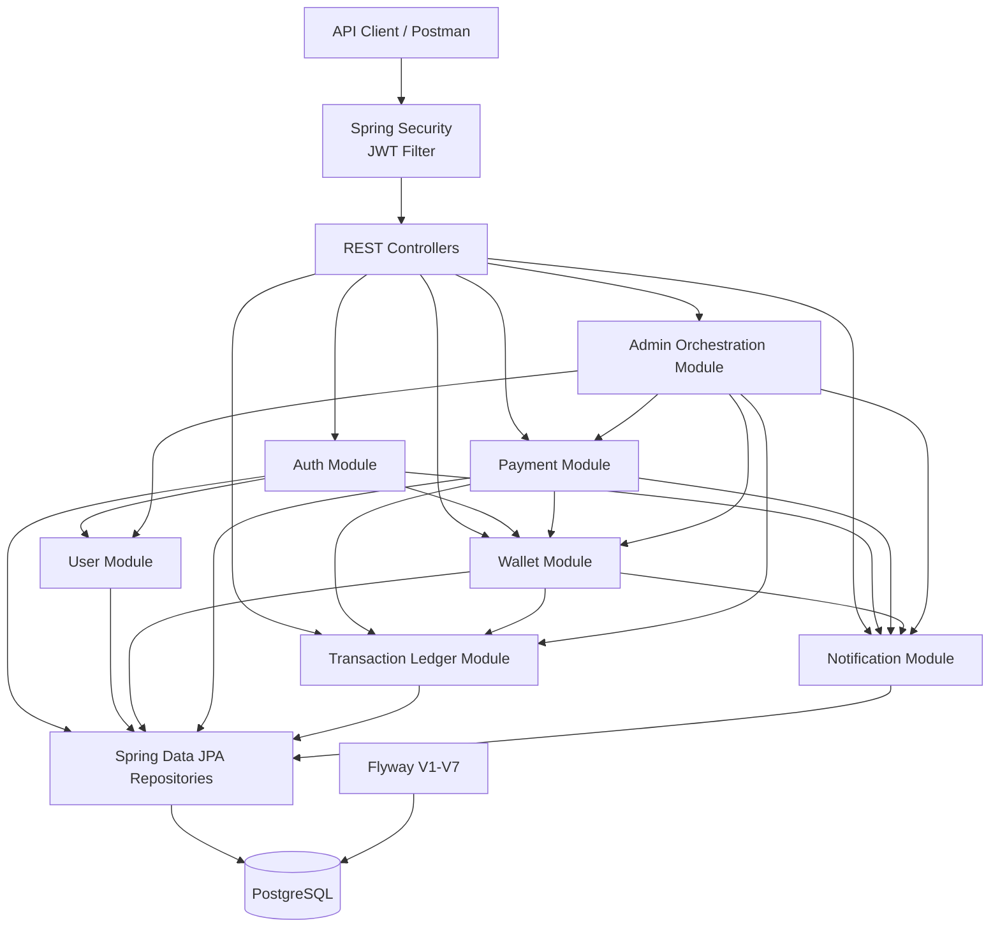

# PayFlow V1 Architecture Diagram

## Architectural rules

- PayFlow V1 is a modular monolith.
- Each business table has one owning module.
- Cross-module communication occurs through services, not foreign repositories.
- The Admin module is an orchestration layer and owns no database table.
- Financial operations use transactional boundaries.
- Payments and transaction-ledger records are immutable.
- Wallet status and balance rules remain inside the Wallet module.
