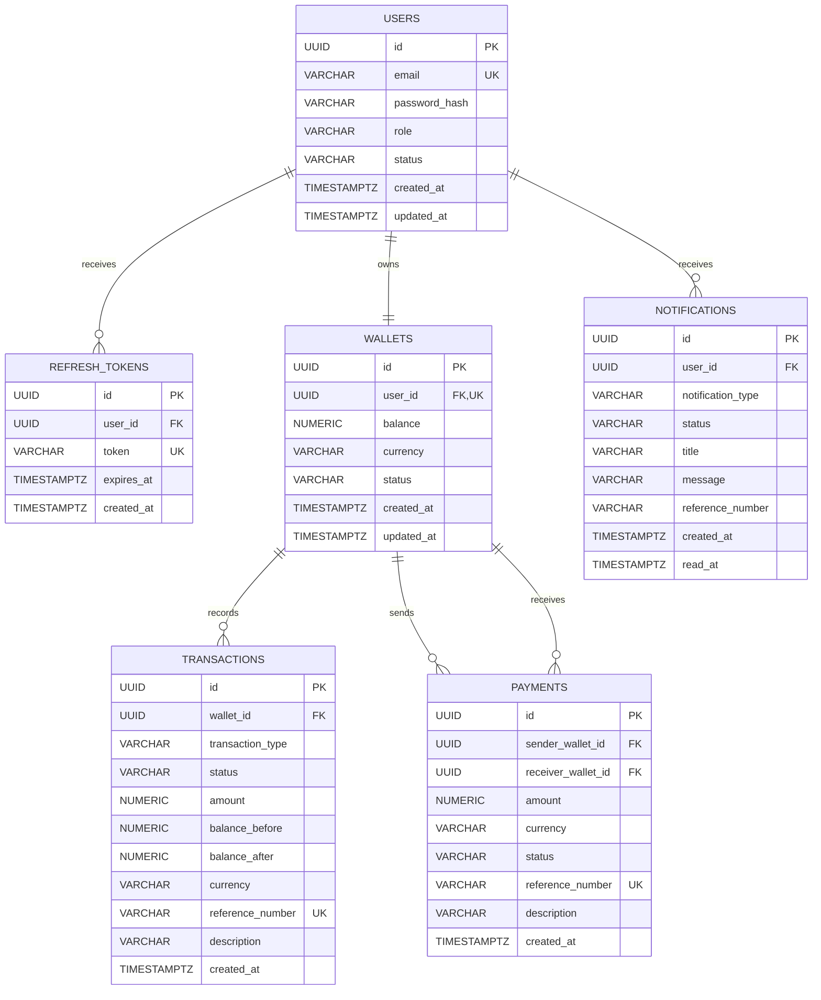

# PayFlow V1 ER Diagram

## Relationship rules

- A user owns exactly one wallet.
- A user may have multiple refresh tokens and notifications.
- A wallet may have multiple immutable ledger transactions.
- A payment links one sender wallet and one receiver wallet.
- The Admin module owns no database table.
